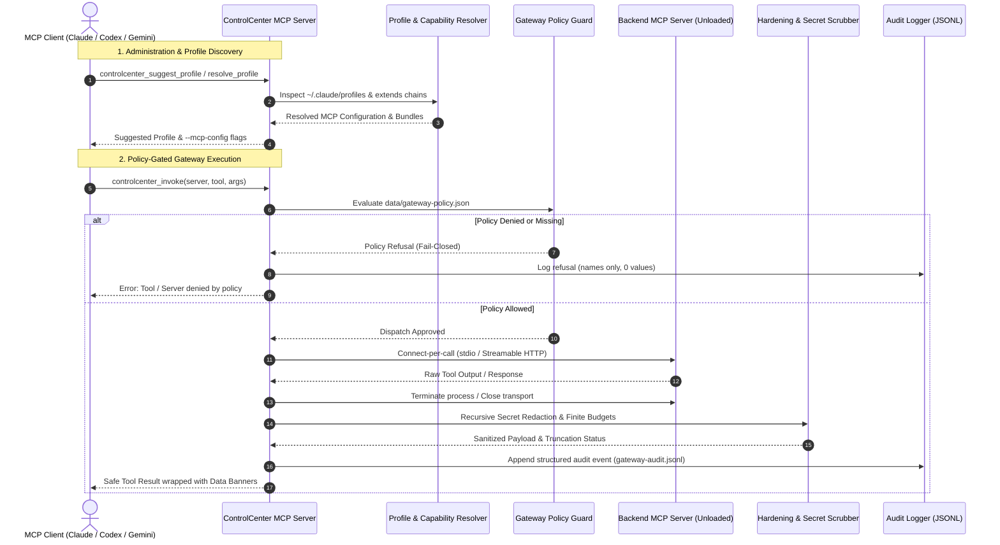

# ellmos ControlCenter MCP

<p align="center">
  
</p>

**DE [Deutsche Version](README_de.md)**

*Part of the [ellmos-ai](https://github.com/ellmos-ai) family.*

[](https://github.com/ellmos-ai/ellmos-controlcenter-mcp/actions/workflows/ci.yml)
[](https://www.npmjs.com/package/ellmos-controlcenter-mcp)
[](https://opensource.org/licenses/MIT)
[](https://nodejs.org/)
[](https://vitest.dev/)
[](#tools)
[](https://nodejs.org/)
[](SECURITY.md)
[](SECURITY.md)
[](https://github.com/ellmos-ai)
[](https://github.com/open-bricks)
[](llms.txt)

> [!NOTE]
> **LLM / AI Agent Integration:** This repository provides an [`llms.txt`](llms.txt) index file for context optimization, RAG discovery, and agent navigation.

---

### Quick Navigation

[Quick Start](#install) • [System Architecture](#system-architecture) • [Control & Gateway Flow](#control-plane--gateway-lifecycle) • [Tools (31)](#tools) • [Gateway](#gateway-reaching-servers-the-host-has-not-loaded) • [Security Policy](SECURITY.md) • [llms.txt Context](llms.txt) • [Ecosystem Matrix](#ellmos-ai-ecosystem)

---

An alpha-stage **Model Context Protocol (MCP) administration server** for local MCP stacks. ControlCenter discovers local MCP servers, reads MCP profile files, groups servers into capability bundles, recommends profiles for a task, builds catalogs, probes real MCP tool lists from local repositories or profiles, assigns tools to capability bundles, and provides an optional local dashboard.

> **What "control" means here — read this before you rely on it.** ControlCenter is a **read-mostly administration surface**. It reads, inventories, resolves, audits, and *generates configuration*. Its only write actions are generating an MCP config file (`controlcenter_switch_profile`) and writing a catalog (`controlcenter_build_catalog`); the dashboard can additionally toggle servers in a profile file, with confirmation and backup.
>
> It does **not** change a running session, does not sit in the request path, does not proxy or execute another server's tools, and does not enforce any permission. In the ellmos taxonomy it is a *control plane* in the narrow sense — it administers MCP servers, profiles, and stacks without owning domain data — **not** a gateway.

> **Provider note:** ControlCenter works with any MCP-capable client (Claude Code, Codex, Gemini, or any stdio-based MCP host). The profile management tools default to Claude Code's profile directory (`~/.claude/profiles`) but accept any directory via `ELLMOS_PROFILE_ROOT`. The skill and plugin inventory tools are scoped to Claude Code conventions by default; see the environment variables below for override options.

The first alpha release focuses on **discovery, profile visibility, dashboard workflows, capability bundles, profile-aware tool-list probes, tool-bundle assignments, internationalization, and initial policy audits**. Since 0.5.0 a **gateway** is added on top: `controlcenter_list_available_tools` and `controlcenter_invoke` reach MCP servers the host has not loaded, under a pattern-based policy and an audit log — see [Gateway](#gateway-reaching-servers-the-host-has-not-loaded). Authentication, risk-class enforcement, and hard security boundaries are still planned, not implemented.

> **Alpha note:** This version is useful for local administration and preview testing. It is not a hardened MCP gateway and should not be used as a security layer for untrusted tools or other users.

## System Architecture

```mermaid
graph TD
    A["Clients (Claude Code, Codex, Gemini, stdio Hosts)"] -->|MCP stdio / JSON-RPC| B["ellmos ControlCenter MCP Server"]
    
    subgraph Core ["Control Plane Modules"]
        B --> C["Catalog Scanner (catalog.ts)"]
        B --> D["Profile Resolver (profiles.ts)"]
        B --> E["Bundle Manager (bundles.ts)"]
        B --> F["Tool Prober (toolCatalog.ts)"]
        B --> G["Policy Auditor (policy.ts)"]
        B --> H["Context Packer (contextPack.ts)"]
        B --> I["i18n Engine (src/i18n)"]
    end
    
    subgraph Storage ["Local System & Environment"]
        C -->|Scans| S1["Local Repos (C:\_Local_DEV\repos)"]
        D -->|Reads / Resolves| S2["Claude Profiles (~/.claude/profiles)"]
        E -->|Loads & Maps| S3["Capability Bundles (data/capability-bundles.json)"]
        F -->|stdio Probes| S4["Local & Profile MCP Servers"]
        G -->|Audits| S5["Policy Rules & Security Risks"]
    end
    
    subgraph UI ["Management Interface"]
        B <-->|HTTP / WebSocket (127.0.0.1:3737)| J["Local Dashboard (dashboard.ts)"]
    end
```

## Control Plane & Gateway Lifecycle



## Status

- **Phase:** Alpha
- **Version:** `0.5.1`
- **Repository:** [`ellmos-ai/ellmos-controlcenter-mcp`](https://github.com/ellmos-ai/ellmos-controlcenter-mcp)
- **npm:** [`ellmos-controlcenter-mcp`](https://www.npmjs.com/package/ellmos-controlcenter-mcp)
- **CI checks:** `npm run test` and `npm run build`
- **Goal:** Make local MCP stacks visible, inspectable, and reproducibly configurable
- **Focus:** Catalogs, profile overview, profile recommendation, bundle recommendation, profile-aware tool-list probes, tool-bundle assignments, i18n, and early audits

## Tools

| Tool | Purpose |
|---|---|
| `controlcenter_status` | Show stack, profile, and detected-server status |
| `controlcenter_actual_self_receipt` | Run a native self `list_tools` probe and emit a short-lived signed runtime receipt when explicitly configured |
| `controlcenter_get_language` | Show the current ControlCenter output language |
| `controlcenter_set_language` | Set the ControlCenter output language for this running server instance |
| `controlcenter_list_local_servers` | Scan local MCP repositories below the MCP root and enrich them with kind and state ownership from `mcps.catalog.v1.json` |
| `controlcenter_describe_mcp` | Describe one MCP server from `mcps.catalog.v1.json`: kind, namespace, state ownership, wrapping, and composition |
| `controlcenter_list_stacks` | Read registered stacks from `stacks.catalog.json` and validate their `ellmos.stack.v2` manifests |
| `controlcenter_describe_stack` | Describe typed components, roles, policies, and validation warnings for one registered stack |
| `controlcenter_context_pack` | Build a bounded, manifest-only handoff for a registered stack at `short`, `execution`, or `full` detail |
| `controlcenter_list_tools` | Start local or profile-defined MCP servers and read their real `list_tools` output |
| `controlcenter_find_capability` | Rank typed native-binding claims from a hash-consistent System Explorer resolution without selecting or executing one |
| `controlcenter_tool_overview` | Show resolution-bound component claims while keeping declared and runtime-state axes separate |
| `controlcenter_assign_tool_bundles` | Assign probed MCP tools to capability bundles |
| `controlcenter_list_bundles` | Group local servers by capability bundle |
| `controlcenter_suggest_bundles` | Recommend bundles for a task |
| `controlcenter_list_profiles` | List MCP profiles from the profile root (defaults to `~/.claude/profiles`; override with `ELLMOS_PROFILE_ROOT`) |
| `controlcenter_suggest_profile` | Recommend a profile for a task |
| `controlcenter_resolve_profile` | Resolve a profile including `extends` chains |
| `controlcenter_switch_profile` | Prepare a generated `--mcp-config` file and configurable launch command |
| `controlcenter_audit_profile` | Run initial policy checks against a profile |
| `controlcenter_build_catalog` | Build a JSON catalog of local MCP servers, optionally including tool probes |
| `controlcenter_list_skills` | Inventory deployed skills (`~/.claude/skills` by default; Claude Code convention, override with `ELLMOS_SKILLS_ROOT`) and the source skills library |
| `controlcenter_find_skill` | Match **keywords** for a task or intent against the scanned skill catalogue and return ranked candidates — see [Querying skill search](#querying-skill-search) |
| `controlcenter_resolve_semantic_route` | Validate an LLM/user-selected role, expert and persona against a provider-neutral map and verify endpoints against the live skill inventory |
| `controlcenter_list_plugins` | Inventory installed plugins (`~/.claude/plugins` by default; Claude Code convention, override with `ELLMOS_PLUGINS_ROOT`) and local ellmos modules |
| `controlcenter_list_locks` | List active `LOCK*.txt` project locks across the configured roots — see [Host registers](#host-registers-locks-permissions-decisions) |
| `controlcenter_check_lock` | Check whether one path is locked, including locks inherited from parent directories |
| `controlcenter_evaluate_permission` | Report what the nearest `LOCK.permissions` register allows an agent to do at a path |
| `controlcenter_list_decisions` | List pending user decisions by identifier, date, title and status |
| `controlcenter_list_available_tools` | List the tools of MCP servers this host has **not** loaded, without loading them — see [Gateway](#gateway-reaching-servers-the-host-has-not-loaded) |
| `controlcenter_invoke` | Run one tool on a server this host has not loaded and return its result, policy-gated and audited |

## Gateway: reaching servers the host has not loaded

A session that loads eleven MCP servers pays for all of their tools at once. The gateway lets the
loaded profile stay small — for example FileCommander, ControlCenter, open-compute — while the
remaining servers stay reachable on demand.

```jsonc
// what is out there, without loading it
{ "name": "controlcenter_list_available_tools", "arguments": { "profile": "full" } }

// run one of those tools; no prior listing required when the name is known
{ "name": "controlcenter_invoke", "arguments": {
    "server": "ellmos-clatcher-mcp", "tool": "fix_umlauts",
    "args": { "path": "C:/tmp/notes.md" } } }
```

**Scope.** Only servers declared by the configured MCP root (`ELLMOS_MCP_ROOT`) or by the profile
named in `profile` can be addressed. That set is the gateway's primary boundary — there is no way
to point it at an arbitrary command.

**Lifecycle.** The connection is opened for the call and closed afterwards. No backend process is
kept running between invocations. The cost is roughly 200–500 ms per call on a cold stdio server;
the benefit is that ControlCenter never leaves child processes behind.

**Failure modes are kept apart.** Four different things can go wrong, and they mean different
things:

| Outcome | Meaning |
|---|---|
| `unknown-server` | The name is not in the addressable set. The known names are returned. |
| `unreachable` | The server exists but could not be asked. **Not** "returned nothing". |
| `unknown-tool` | The server has no such tool. Its available tool names are returned, so a wrong guess self-corrects in one step. |
| `target-error` | The call arrived and the target reported a tool error. This is a backend result, not a ControlCenter failure. |

A listing over several servers states at the top when some of them could not be asked, so a partial
result is never mistaken for a complete one.

**Policy.** `data/gateway-policy.json` (override with `ELLMOS_GATEWAY_POLICY`):

```json
{
  "schema": "ellmos.controlcenter.gateway-policy.v1",
  "mode": "open",
  "deny": [{ "server": "*", "tool": "*_delete_*", "reason": "Deletion stays manual." }],
  "allow": []
}
```

`mode: "open"` allows every tool of an addressable server; `mode: "allowlist"` requires a matching
`allow` rule. `deny` always wins, and `*` is a wildcard in both fields. A malformed or
schema-foreign policy file **refuses every invocation** rather than falling back to allow-all.

**Audit.** Every invocation, including refused ones, is appended as one JSON line to
`~/.ellmos/controlcenter/gateway-audit.jsonl` (`ELLMOS_GATEWAY_AUDIT_LOG`; set it to `off` to
disable). The entry holds argument **names and count — never argument values** — plus the masked
connection command or URL, outcome, duration and content-block count, never result content. The
tool output reports whether the write succeeded, so a failed audit is visible; set
`ELLMOS_GATEWAY_AUDIT_REQUIRED=1` to turn a failed write into a refused call.

**Hardening.** Forwarded payloads are foreign data, so the invoke path is bounded on every axis:

| Control | Behaviour |
|---|---|
| Recursive redaction | Narrow credential shapes (`sk-`, `ghp_`, `AKIA`, JWT, …) are replaced **everywhere**, at every nesting level. Secret-named keys (`auth`, `token`, `apiKey`, …) are wiped whole **only in `structuredContent`** — never in content blocks, which carry the payload the caller asked to read. The result reports how many values changed. Disable with `redactResults: false` — a deliberate weakening. |
| Request budget | Oversized arguments are **refused**, never shortened; a truncated argument set would silently change the request. `ELLMOS_GATEWAY_MAX_REQUEST_BYTES`, default 256 KiB. |
| Response budget | Oversized answers are **truncated and flagged**, so the part that arrived stays usable. `ELLMOS_GATEWAY_MAX_RESPONSE_BYTES`, default 1 MiB. |
| Nesting and blocks | `ELLMOS_GATEWAY_MAX_DEPTH` (32) and `ELLMOS_GATEWAY_MAX_CONTENT_BLOCKS` (200). Cycle-safe, so a self-referential payload cuts off instead of looping. |
| Concurrency | `ELLMOS_GATEWAY_MAX_CONCURRENT` (4). Without it a parallel batch would spawn one backend process each. A call that gets no slot is refused, not queued forever. |
| Transport | HTTPS only; plain HTTP allowed on loopback alone. Redirects refused. Narrow further with `allowedRemoteHosts` (supports `*.` subdomains). |
| Untrusted marking | Forwarded content is fenced with a banner marking it as data, not instructions — the gateway pipes third-party output into an agent's context. |

**Not included.** Connection pooling, streaming and progress pass-through, sampling, elicitation,
backend resources and prompts, and risk-class policies derived from tool annotations. Opaque
session-bound capabilities have no counterpart yet, because no session is held and no capability
handle is issued. Only the MCP adapter exists; module, stack and folder adapters remain open.

## Catalog discovery

ControlCenter reads three hand-curated catalogs instead of hard-coding individual paths. Each root is configurable, and each catalog is optional.

| Catalog | Schema | Root (env override) | Used by |
|---|---|---|---|
| `modules.catalog.json` | `ellmos.modules-catalog.v1` | `.AI/.MODULES` (`ELLMOS_MODULES_ROOT`) | `controlcenter_list_plugins` |
| `stacks.catalog.json` | `ellmos.stacks.catalog.v1` | `.AI/.STACKS` (`ELLMOS_STACKS_ROOT`) | `controlcenter_list_stacks`, `controlcenter_describe_stack`, `controlcenter_context_pack` |
| `mcps.catalog.v1.json` | `ellmos.mcps.v1` | `.AI/.MCP` (`ELLMOS_MCP_CATALOG`) | `controlcenter_list_local_servers`, `controlcenter_describe_mcp`, `controlcenter_status` |

The MCP catalog contributes what a directory scan cannot see: `mcp_kind` (`tool`, `adapter`, `stack`, `control-plane`), whether a server keeps persistent state, and which component owns that state per namespace. The directory scan stays the source for what is actually installed, so both directions are reported: a scanned server without a catalog entry keeps empty catalog fields, and a catalog entry without a directory is listed separately rather than dropped. Entries are joined on the catalog `id` first and on the npm package name second, because a server may publish under a different name than its directory.

A missing, unreadable, or foreign-schema catalog never fails a tool call. The enriched fields degrade to empty and the output names the reason, so an absent catalog is distinguishable from a server that genuinely holds no state. An unreadable MCP root is likewise reported as unreadable instead of as an empty result.

## Host registers: locks, permissions, decisions

The four tools above answer a different question from the rest of this server: not
*"what can I configure?"* but *"what applies on this machine right now?"* They read three
host-local registers — project locks, an agent-neutral permission register, and a pending
decision list.

They are **read-only**. No lock is created, renewed or released; no decision is answered.
`LOCK.user.*` locks in particular are removed by the user alone, and nothing here can touch
them.

**They fail closed.** If a register is unconfigured, a path is unreadable, the interpreter is
missing or a check errors, the verdict is `unknown` and *safe to proceed* is `no` — never a
reassuring "clear". A lock checker that guesses in the reassuring direction is more dangerous
than none at all.

**Inheritance is respected.** A `LOCK.txt` in a parent directory locks everything beneath it,
so `controlcenter_check_lock` walks the whole ancestor chain and reports the effective lock
with its distance, not just a file sitting in the same folder.

**Lock semantics are not reimplemented here.** A small bridge script delegates every rule —
expiry, protected lock types, scope parsing, permission precedence `deny > ask > allow > default`
— to the host's canonical Python modules. A second implementation would drift from the spec on
the next change to it. This is the one place where the server calls Python; if no interpreter is
available the tools fail closed like any other unmet precondition.

### Configuration

These tools are **inert until configured**, because these registers do not exist on a
machine that has not set them up:

| Variable | Purpose |
|---|---|
| `ELLMOS_LOCK_SCRIPTS` | Directory holding the canonical `lock_utils.py`, `permissions.py` and `lock_scan.py`. Required by the three lock and permission tools. |
| `ELLMOS_LOCK_ROOTS` | Optional path to `lock_roots.json`. Defaults to the file beside the lock scripts. |
| `ELLMOS_DECISIONS_ROOT` | Directory holding the decision chain and its generated index. Required by `controlcenter_list_decisions`. |
| `ELLMOS_PYTHON` | Interpreter to run the bridge with. Defaults to `python`, falling back to `python3`. |

### What these tools deliberately do not return

`controlcenter_list_decisions` returns identifiers, dates, titles, status and scope — not the
question texts, options or recommendations, which can describe personal circumstances. Read
those in the register itself.

### Cost of a full scan

`controlcenter_list_locks` walks every configured root. Over cloud-synced storage that takes
minutes, so the scan runs under a wall-clock budget, checked between roots. If the budget runs
out, the result is marked **incomplete** and names the roots that were never reached — an
incomplete scan proves nothing about them. For a single path, `controlcenter_check_lock` is the
right tool and answers in milliseconds.

## Querying skill search

`controlcenter_find_skill` matches **purely lexically** over name, aliases, tags, category and
description. It does **not** yet do semantic/embedding search, so **query with keywords and
technical terms, not with whole sentences.** A natural-language sentence drags in filler words,
and those can outrank the correct hit.

## Resolution-bound capability search

`controlcenter_find_capability` and `controlcenter_tool_overview` consume an explicit
`system-explorer.resolution.v1` file. They fail closed unless its content hash is self-consistent and
its component-registry source-verification claim is present. That claim is **not external provenance**:
until System Explorer emits a separately trusted receipt, output fields explicitly report
`provenance_verified: false` and `identity_verified: false`. Only stable, type-consistent native-binding
claims are returned. Results use
the method `controlcenter-lexical-candidate` and score domain `controlcenter.lexical.v1`; they never
select a provider, prove identity or availability, or authorize execution. Semantic routing remains a separate
advisory producer.

| | Query | Top result |
|---|---|---|
| ❌ | `My program crashes when saving and I don't know why` | `mcp-config-sync` (score 6 — matched on *when*, *know*, *why*) |
| ✅ | `debug bug test failure` | `bugfix-protocol` (score 5 — matched on *bug*, *debug*) |

Two consequences:

- **Scores are only comparable within a single query.** In the example above the wrong hit scored
  *higher* than the right one in a different query. Never treat the number as a confidence measure.
- **If the caller is an LLM, translate the user's phrasing into keywords first.** That step is
  cheap and turns the weakest case into the strongest one.

Until semantic search is supported (tracked in `TODO.md`), keyword queries are the intended usage —
not a workaround.

## Semantic role and skill routing

`controlcenter_resolve_semantic_route` keeps semantic role selection with the caller LLM or the
user, validates the selected coordinator/expert/persona edges against a
`semantic-persona-routing.map.v1` file, and checks explicit skill endpoints against the current
skill inventory. The default map is `~/.ellmos/controlcenter/routing/semantic-persona-routing-map.v1.json`
and can be overridden with `ELLMOS_SEMANTIC_ROUTING_MAP` or a tool input.

Lexical candidates remain separately labelled. A routing-map candidate can become a verified
endpoint only after the caller explicitly confirms it as a second semantic/source signal and the
skill is uniquely present in the deployed live inventory. Nested map records, stable IDs, enums,
references, and uniqueness are validated fail-closed. The route grants no tool or execution authority.

## Dashboard

After building the project, start the local dashboard with:

```bash
npm run dashboard
```

Default address:

```text
http://127.0.0.1:3737
```

The dashboard can currently show local servers and profiles, switch its UI language, enable or disable servers per profile, summarize profile audits, scan MCP tools for the selected profile or local repositories, display tool-to-bundle assignments, and write a generated `--mcp-config` file. Write actions ask for confirmation and create a backup before overwriting an existing file.

## Discovery and Registry Metadata

ControlCenter ships MCP registry metadata for crawlers and catalog tools:

- `server.json` uses the official MCP server metadata shape with the package name, repository, and stdio transport.
- `llms.txt` gives LLM crawlers a compact project summary, canonical links, and tool overview.
- `package.json` includes both files in the npm package so registry indexers can read the same metadata from GitHub or npm.

The public npm package is the canonical install target. The GitHub repository remains the canonical source for development, issues, and release notes.

## Search and Discovery Context

Use the full name **ellmos ControlCenter MCP** or the package name `ellmos-controlcenter-mcp` when linking or searching. The short phrase "control center" is too broad, and "ellmos" can collide with Elmo/ELMO motion-control, HR, and voice-generator results.

Best-fit search phrases:

- `ellmos ControlCenter MCP`
- `ellmos-controlcenter-mcp`
- `MCP control plane for local servers`
- `MCP profile management dashboard`
- `local MCP stack discovery TypeScript`
- `Claude Codex Gemini MCP profile switcher`
- `MCP policy audit profile management`

## Installation

### Option 1: Install from npm

```bash
npm install -g ellmos-controlcenter-mcp
```

Start the MCP server:

```bash
ellmos-controlcenter
```

Start the dashboard:

```bash
ellmos-controlcenter-dashboard
```

### Option 2: Install from source

```bash
git clone https://github.com/ellmos-ai/ellmos-controlcenter-mcp.git
cd ellmos-controlcenter-mcp
npm install
npm run build
```

Run the server from source:

```bash
node dist/index.js
```

Run the dashboard from source:

```bash
node dist/dashboard.js
```

## Configuration

### MCP Client Configuration

ControlCenter works with any MCP-capable client. The JSON snippet below uses the standard `mcpServers` format supported by Claude Code, Claude Desktop, Codex, Cursor, and other MCP hosts.

If installed globally from npm:

```json
{
  "mcpServers": {
    "controlcenter": {
      "command": "ellmos-controlcenter"
    }
  }
}
```

If installed from source:

```json
{
  "mcpServers": {
    "controlcenter": {
      "command": "node",
      "args": [
        "/absolute/path/to/ellmos-controlcenter-mcp/dist/index.js"
      ]
    }
  }
}
```

Optional environment variables:

- `ELLMOS_MCP_ROOT` overrides the default MCP repository root
- `ELLMOS_STACKS_ROOT` overrides the stack catalog root (default: local `.AI/.STACKS`)
- `ELLMOS_MCP_CATALOG` overrides the MCP catalog file (default: `mcps.catalog.v1.json` inside the MCP root)
- `ELLMOS_MODULES_ROOT` overrides the module catalog root (default: local `.AI/.MODULES`)
- `ELLMOS_PROFILE_ROOT` overrides the profile directory (default: `~/.claude/profiles`)
- `ELLMOS_SKILLS_ROOT` overrides the deployed skills directory (default: `~/.claude/skills`)
- `ELLMOS_PLUGINS_ROOT` overrides the plugins directory (default: `~/.claude/plugins`)
- `ELLMOS_BUNDLE_CONFIG` overrides the capability bundle definition file
- `ELLMOS_POLICY_CONFIG` overrides the profile audit policy rule file
- `ELLMOS_LAUNCH_TEMPLATE` overrides the generated profile-switch launch command. Use `{config}` as placeholder for the generated MCP config path.
- `ELLMOS_CONTROLCENTER_ACTUAL_SELF_CONFIG` points to the host-local, fail-closed actual-self producer configuration. If it is absent, `controlcenter_actual_self_receipt` emits no receipt.
- `CONTROLCENTER_LANGUAGE` or `ELLMOS_CONTROLCENTER_LANGUAGE` sets the initial output language

### Signed actual-self receipts

`controlcenter_actual_self_receipt` is an optional evidence producer for System Explorer. It starts a fixed child instance of this package, reads only its MCP `list_tools` surface, hashes a redacted tool summary, and returns an Ed25519-signed `ellmos.actual-self-component-receipt.v1`. It never executes a reported tool and never returns the signing key, configuration path, environment, raw descriptions, or local paths.

The host-local JSON configuration must use `ellmos.controlcenter.actual-self-producer.v1` and contain exactly `enabled`, `scope`, `registry_binding`, `signer_id`, `private_key_path`, `private_key_sha256`, and `ttl_seconds` in addition to `schema`. TTL is limited to 300 seconds. The configured host must match the native hostname and the private key must match its lowercase SHA-256 pin. Trust-store provisioning and route activation are deliberately external operations; producing a receipt does not make it trusted.

By default, the MCP repository root is derived from the `OneDrive`/`ONEDRIVE` environment variable and falls back to `~/OneDrive/.TOPICS/.AI/.MCP`.

## Internationalization

ControlCenter supports the language codes `de`, `en`, `es`, `zh`, `ja`, and `ru`. All six languages now have maintained text sets for MCP tool output, dashboard labels, policy hints, profile recommendations, and tool descriptions.

Use `controlcenter_get_language` to inspect the current language and `controlcenter_set_language` to switch MCP tool output at runtime. The dashboard also includes a language selector and accepts `/?lang=en` style links. Bundle titles and descriptions loaded from custom JSON config files are shown as authored.

## Profile Switching

`controlcenter_switch_profile` does not change a running session. It creates a resolved MCP configuration and returns a launch command. The default remains compatible with Claude Code:

```bash
claude --mcp-config ~/.claude/profiles/_generated/software.mcp.json
```

With `write: false`, the switch runs as a preview. With `write: true`, ControlCenter writes the generated file. The generated `mcpServers` JSON is readable by any MCP-capable client. Use the `launchTemplate` input or `ELLMOS_LAUNCH_TEMPLATE` to return a Codex, Gemini, or custom launcher command, for example `codex mcp run --config {config}`.

A planned optional restart/reconnect workflow will keep this boundary: after a written profile change, ControlCenter should surface a restart hint and copyable launch command for Claude Code, while automatic reconnection stays behind an explicit, client-specific adapter and must fail closed when unsupported.

Profile resolution supports single inheritance (`"extends": "base"`), multiple inheritance (`"extends": ["base", "shared"]`), and inherited-server removal via `"remove"`, `"disabled"`, or `"disabledServers"`. Missing profiles, invalid JSON, invalid profile names, and inheritance cycles now return explicit profile errors with the affected file path or chain.

## Capability Bundles

ControlCenter loads capability bundle definitions from `data/capability-bundles.json`. The default file groups local servers into these bundles:

- `core-local`
- `software`
- `filesystem`
- `automation`
- `control-plane`

Custom bundle files can be supplied with `ELLMOS_BUNDLE_CONFIG` or with the optional `bundleConfigPath` input on bundle tools. A bundle file is a JSON object with `schemaVersion` and a `bundles` array. Each bundle needs `id`, `title`, `description`, and `keywords`.

This is the basis for future tool-bloat management: instead of exposing many individual tools immediately, an agent can first choose the capability bundle that fits the task.

## Tool Catalog

`controlcenter_list_tools` can start local stdio MCP servers or resolved Claude profile servers and call the standard MCP `list_tools` request. Profile scans support arbitrary stdio commands, including non-Node launchers, and URL-based remote configs using Streamable HTTP or legacy SSE. The scan is explicit, uses a per-server timeout, does not call any reported tool, and closes each spawned local server after reading the tool list.

`controlcenter_build_catalog` accepts `includeTools: true` to persist the same probe results alongside the local server catalog.

`controlcenter_assign_tool_bundles` compares probed tool names, titles, descriptions, server names, source, and transport metadata with capability-bundle keywords, then reports which tools belong to bundles such as filesystem, software, automation, or control plane.

## Profile Audit

`controlcenter_audit_profile` is the first small policy layer. It currently flags:

- `npx` starts
- environment variables in server configurations
- missing or invalid server commands
- sensitive name fragments in arguments

Environment values are never printed.

Policy rules are loaded from `data/policy-rules.json` by default. The file can disable individual rules or override their severity, and `controlcenter_audit_profile` also accepts a `policyConfigPath` input for one-off audits.

## Project Structure

```text
ellmos-controlcenter-mcp/
|-- src/
|-- test/
|-- data/
|-- README.md
|-- README_de.md
|-- START.md
|-- ARCHITECTURE.md
|-- STATE.md
|-- DECISIONS.md
`-- TODO.md
```

## Documentation

| For... | Read... |
|---|---|
| Quick start | [START.md](./START.md) |
| Current state | [STATE.md](./STATE.md) |
| Architecture | [ARCHITECTURE.md](./ARCHITECTURE.md) |
| Roadmap | [ROADMAP.md](./ROADMAP.md) |
| Decisions | [DECISIONS.md](./DECISIONS.md) |
| Open tasks | [TODO.md](./TODO.md) |
| Changes | [CHANGELOG.md](./CHANGELOG.md) |
| LLM crawler summary | [llms.txt](./llms.txt) |

## ellmos-ai Ecosystem

This MCP server is part of the **[ellmos-ai](https://github.com/ellmos-ai)** ecosystem — AI infrastructure, MCP servers, and intelligent tools.

### MCP Server Family

| Server | Tools | Focus | npm |
|--------|-------|-------|-----|
| [FileCommander](https://github.com/ellmos-ai/ellmos-filecommander-mcp) | 47 | Filesystem, process management, interactive sessions, cloud-lock-safe operations | [`ellmos-filecommander-mcp`](https://www.npmjs.com/package/ellmos-filecommander-mcp) |
| [CodeCommander](https://github.com/ellmos-ai/ellmos-codecommander-mcp) | 22 | Code analysis, JSON repair, imports, diffs, regex | [`ellmos-codecommander-mcp`](https://www.npmjs.com/package/ellmos-codecommander-mcp) |
| [Clatcher](https://github.com/ellmos-ai/ellmos-clatcher-mcp) | 12 | File repair, format conversion, batch operations | [`ellmos-clatcher-mcp`](https://www.npmjs.com/package/ellmos-clatcher-mcp) |
| [n8n Manager](https://github.com/ellmos-ai/n8n-manager-mcp) | 19 | n8n workflow management via AI assistants | [`n8n-manager-mcp`](https://www.npmjs.com/package/n8n-manager-mcp) |
| **[ControlCenter](https://github.com/ellmos-ai/ellmos-controlcenter-mcp)** | **31** | **MCP stack, tool and skill discovery; profile resolution and audit; host lock, permission and decision registers** | **[`ellmos-controlcenter-mcp`](https://www.npmjs.com/package/ellmos-controlcenter-mcp)** |
| [Homebase](https://github.com/ellmos-ai/ellmos-homebase-mcp) | 45 | Local-first LLM memory, knowledge, state, routing, swarm orchestration | [`ellmos-homebase-mcp`](https://www.npmjs.com/package/ellmos-homebase-mcp) (alpha) |
| [ServerCommander](https://github.com/ellmos-ai/ellmos-servercommander-mcp) | 8 | Server operations: health checks, log analysis, deploy dry-runs, mail diagnostics | [`ellmos-servercommander-mcp`](https://www.npmjs.com/package/ellmos-servercommander-mcp) (alpha) |
| [Blender Use](https://github.com/ellmos-ai/ellmos-blender-use-mcp) | 3 | Headless Blender asset QA and FBX reimport verification | [`ellmos-blender-use-mcp`](https://www.npmjs.com/package/ellmos-blender-use-mcp) (alpha) |
| [Open Compute](https://github.com/ellmos-ai/open-compute-mcp) | 10 | Model-agnostic computer use: capture, safety-gated actions, Windows UIA | [`open-compute-mcp`](https://www.npmjs.com/package/open-compute-mcp) (alpha) |

### AI Infrastructure

| Project | Description |
|---------|-------------|
| [BACH](https://github.com/ellmos-ai/bach) | Local-first text-based OS for LLM agents — 113+ handlers, 550+ tools, SQLite memory |
| [workflowhooker-provenance](https://github.com/ellmos-ai/workflowhooker-provenance) | Local-first lifecycle hooks, scope guardrails & runtime provenance |
| [open-compute](https://github.com/ellmos-ai/open-compute) | Model-agnostic computer-use core powering Open Compute MCP |
| [clutch](https://github.com/ellmos-ai/clutch) | Provider-neutral LLM orchestration with auto-routing and budget tracking |
| [rinnsal](https://github.com/ellmos-ai/rinnsal) | Lightweight agent memory, connectors, and automation infrastructure |
| [ellmos-stack](https://github.com/ellmos-ai/ellmos-stack) | Self-hosted AI research stack (Ollama + n8n + Rinnsal + KnowledgeDigest) |
| [MarbleRun](https://github.com/ellmos-ai/MarbleRun) | Autonomous agent chain framework for Claude Code |
| [gardener](https://github.com/ellmos-ai/gardener) | Minimalist database-driven LLM OS prototype (4 functions, 1 table) |
| [ellmos-tests](https://github.com/ellmos-ai/ellmos-tests) | Testing framework for LLM operating systems (7 dimensions) |

### Open-Science & Research

| Project | Ecosystem | Focus |
|---|---|---|
| [build-your-users-mind](https://github.com/research-line/build-your-users-mind) | `research-line` | Open-science user mental model reconstruction & cognitive framework |

### Desktop Software & Companion Tools

Our partner organization **[open-bricks](https://github.com/open-bricks)** bundles AI-native desktop applications — a modern, open-source software suite built for the age of AI.

| Project | Ecosystem | Focus |
|---|---|---|
| [ProFiler](https://github.com/open-bricks/ProFiler) | `open-bricks` / `file-bricks` | Advanced file management, checksums, duplicate detection, and batch operations |
| [lock-master](https://github.com/file-bricks/lock-master) | `open-bricks` / `file-bricks` | Local-first multi-agent project locking and permission governance |
| [DokuZen](https://github.com/open-bricks/DokuZen) | `open-bricks` / `doc-bricks` | Document management, text extraction, OCR, and PDF processing |
| [UniversalDocsGrabber](https://github.com/doc-bricks/UniversalDocsGrabber) | `open-bricks` / `doc-bricks` | Universal document grabbing, batch ingestion, OCR & text normalization |
| [safe-start-for-codex](https://github.com/dev-bricks/safe-start-for-codex) | `open-bricks` / `dev-bricks` | Local-first runtime guard and environment validator for AI coding agents |
| [automation-master](https://github.com/dev-bricks/automation-master) | `open-bricks` / `dev-bricks` | Multi-agent coordination and background automation engine |
| [DevCenter](https://github.com/dev-bricks/DevCenter) | `open-bricks` / `dev-bricks` | Developer productivity center and workspace manager |
| [CodeBox](https://github.com/dev-bricks/CodeBox) | `open-bricks` / `dev-bricks` | Sandboxed script execution and multi-language scratchpad |
| [system-gap-master](https://github.com/dev-bricks/system-gap-master) | `open-bricks` / `dev-bricks` | System gap discovery, test gap analysis & contract validation |

## License

[MIT](LICENSE) - Lukas Geiger ([ellmos-ai](https://github.com/ellmos-ai))

## Bundles and partners

ControlCenter MCP remains a standalone, published MCP server. In the V4
composition it is an optional **MCP access surface** of the
`ellmos-core-discovery-bundle`: it exposes local MCP-stack, profile, tool and
skill discovery to people and MCP-capable clients. It is not the functional
owner of policies, decisions, memory, automations, system maps, or the modules
behind the discovered tools.

Configured component registries, local MCP servers, profile files and skill
libraries are discovery partners, not bundled ownership transfers. The
published ControlCenter identity and package name remain unchanged.
`ControlRoom` is a separate planned operator stack, not a rename or a hidden
replacement for this server.

Authoritative bundle membership, versions, profiles and any private
composition recipes remain in the corresponding bundle manifests. This public
section is discovery-only.
